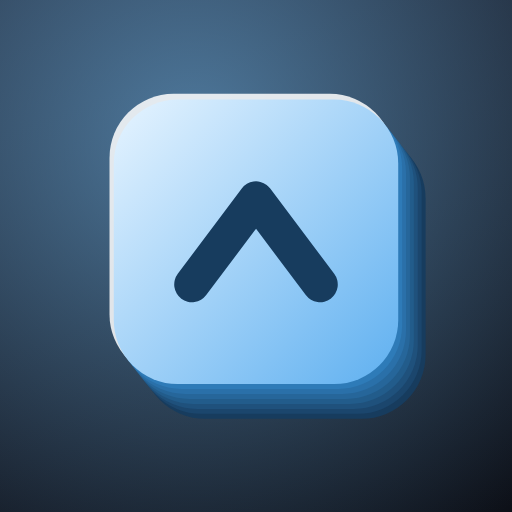

<div align="center">



# Overkey

Modifier and navigation keys in a bar above the keyboard you already use, in any Android app. No root needed.

[](https://github.com/Y-T-G/overkey/actions/workflows/build.yml)
[](LICENSE)
[](#install)
[](https://github.com/Y-T-G/overkey/releases/latest)
[](https://f-droid.org/packages/dev.noblebits.overkey/)

</div>

Overkey puts Ctrl, Alt, Shift, Meta, Esc, Tab, Home, End, Page Up, Page Down and the arrow keys
in a bar that appears above whatever keyboard you have open and goes away with it. It delivers
them to the app in front the way a hardware keyboard does, so the shortcuts work everywhere: a
terminal, a code editor, a browser, a chat, a spreadsheet.

It doesn't fight your muscle memory. Your keyboard, its layout, its swipe and its dictionary stay
exactly as they are. The bar is a window drawn on top, not a replacement keyboard, so the extra
keys are there in every app rather than only the one that added them, and the keys you already
know do what you expect:

- <kbd>Ctrl</kbd> + <kbd>C</kbd> and <kbd>Ctrl</kbd> + <kbd>V</kbd> to copy and paste.
- <kbd>Ctrl</kbd> + <kbd>Z</kbd> to **Undo** and <kbd>Ctrl</kbd> + <kbd>Shift</kbd> + <kbd>Z</kbd> to **Redo**.
- <kbd>Ctrl</kbd> + <kbd>A</kbd> to select all, and <kbd>Shift</kbd> with the arrows to select by hand.

## What it does

- **Modifier keys, held or locked.** Tap a modifier and it is armed for the next key. Hold it and
  tap other keys for a chord. Long-press to lock it down, tap again to let go.
- **A chord grid.** With Ctrl, Alt or Meta armed, a grid of letters appears over the keyboard,
  because the keyboard underneath commits words rather than key presses and so cannot join a
  chord. Tap C there for Ctrl + C.
- **Copy any text.** In aim mode, lift the text under your finger into a panel, select part of it
  and copy, for a chat message or anything else that only lets you copy the whole thing.
- **Copy any image.** Put the picture under your finger on the clipboard as it appears on screen,
  where the app offers no copy at all, a chat photo or a picture on a web page.
- **Share to clipboard.** Overkey shows up in any app's share sheet as *Copy to clipboard*. Share
  text, a picture, a file or several, and they go on the clipboard so the next
  <kbd>Ctrl</kbd> + <kbd>V</kbd> pastes them.
- **Volume keys as modifiers.** While a keyboard is up or the bar is pinned, holding Volume Down
  holds Ctrl, as in Termux. Any volume key can be bound to a modifier, and the volume stays put
  while a bound key is at work.
- **Mouse in aim mode.** Tap for a click, drag for a mouse drag (which selects text in a browser
  instead of scrolling), hold for a right click. Double-tap and drag to scroll with a finger
  instead, at your own speed, so a flick still flings.
- **Pinned mode.** Bring the bar up with no keyboard, for <kbd>Ctrl</kbd> + <kbd>Z</kbd> on a
  screen with no text field.
- **Yours to theme.** The bar takes its colours from your wallpaper by default, or from eleven
  editor themes (Termux, Dracula, Monokai, One Dark, Nord, Gruvbox, Solarized, Catppuccin, Tokyo
  Night, GitHub Light). Opacity and row height are sliders, and the grid's edges can be dragged to
  line up with your keyboard's letters.

## How keys reach the app in front

The bar is an overlay; drawing it needs "Display over other apps". Delivering keys to other apps
needs a small helper process, started once per boot, over a loopback socket that never leaves the
phone. There are three ways to start it, and the settings screen walks through each and says
whether the helper is running:

1. **Shizuku.** No root and no PC after the first setup.
2. **adb.** No root, one `adb shell` command from a PC or over wireless debugging.
3. **Root.** Started for you now and after every reboot, nothing else to do.

There is no accessibility service to enable; the app does not declare one.

## Install

Overkey is the same app wherever you get it. The builds here and on F-Droid are free. The Google
Play build is paid, to recoup the cost of the developer account and its upkeep; buying it is a way
to support the work, not a way to get anything the free builds lack.

- **GitHub:** download the APK from the [latest release](https://github.com/Y-T-G/overkey/releases/latest).
- **F-Droid:** [f-droid.org/packages/dev.noblebits.overkey](https://f-droid.org/packages/dev.noblebits.overkey/) (submitted).
- **Google Play:** [play.google.com/store/apps/details?id=dev.noblebits.overkey](https://play.google.com/store/apps/details?id=dev.noblebits.overkey) (paid).

Android 11 (API 30) and up. The download is about 75 KB.

The builds are signed with different keys: the Play one by Google, through Play App Signing, and
the ones here with our own key. Android will not update an app across a change of signing key, so
switching from one source to the other means uninstalling first. The app is the same either way;
only the signature differs.

## Build from source

You need a JDK 17 and the Android SDK. Then:

```bash
./gradlew assembleRelease
```

The APK is written to `app/build/outputs/apk/release/`.

With no keystore the release build is signed with the debug key, so a fresh clone builds and
installs without any setup. That key is generated per machine, so an APK signed with it is for
trying the app, not for giving to anyone: the next machine's build will not install over it. To
sign properly, put a `keystore.properties` next to `settings.gradle.kts` (it is not tracked):

```properties
storeFile=/path/to/release.jks
storePassword=...
keyAlias=...
keyPassword=...
```

CI reads the same four values from the environment instead, and only attaches an APK to a GitHub
release when they are set.

## Privacy

The app collects nothing, sends nothing anywhere and has no accounts. Its only network connection
is the loopback socket to the helper on the phone itself. No analytics, no crash reporting, no
advertising. The [privacy policy](https://noblebits.dev/overkey/privacy.html) says the same in the
form Google Play asks for.

## For contributors

- [`AGENTS/ARCHITECTURE.md`](AGENTS/ARCHITECTURE.md) is the full tour of how the overlay, the
  injector and the protocol fit together.
- [`AGENTS/AGENTS.md`](AGENTS/AGENTS.md) is the short brief for anyone, human or AI, making a
  change: how to build and test, and the conventions the code follows.

## Licence

[GPL-3.0](LICENSE). You may use, study, share and modify the app, and any distributed fork must
stay under the same licence. The paid Google Play build is the same GPL source; the licence allows
selling a copy, and the source for every build is here.
